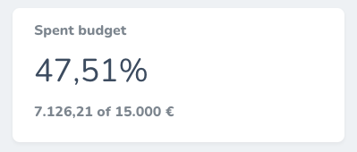

# Nova Percentage Card
A Laravel Nova card to display percentages



## Support us
[](https://laradir.com/?utm_campaign=github&utm_source=banner)


## Requirements

- `php: >=7.1`
- `laravel/nova: ^2.0|^3.0`

## Installation
```bash
composer require creagia/nova-percentage-card
```

## Localization
Publish the package language files to your application's `resources/lang/vendor` directory:
```
php artisan vendor:publish --provider="Creagia\NovaPercentageCard\CardServiceProvider"
```

## Usage:
- Create a Class extending `\Creagia\NovaPercentageCard\NovaPercentageCard`
- Add a new Object to the `cards()` method

### Basic example
```php
class SpentBudget extends \Creagia\NovaPercentageCard\NovaPercentageCard
{
    /**
     * Get the total of filtered records
     *
     * @return float
     */
    function getCount(): float
    {
        return Order::sum('total');
    }

    /**
     * Get the number of the total records
     *
     * @return float
     */
    function getTotal(): float
    {
        return config('app.total_budget');
    }
}
```

```php
class NovaServiceProvider extends NovaApplicationServiceProvider

...

/**
 * Get the cards that should be displayed on the default Nova dashboard.
 *
 * @return array
 */
protected function cards()
{
    return [
        new SpentBudget,
    ];
}

```
### Full example
```php
class SpentBudget extends \Creagia\NovaPercentageCard\NovaPercentageCard
{
    /**
     * The displayable name of the metric.
     *
     * @var string
     */
    protected $name = 'Spent budget';
    
    /**
     * The label for the total entries.
     *
     * @var string|null
     */
    protected $label = '€';

    /**
     * The number of decimal points
     *
     * @var int
     */
    protected $percentagePrecision = 2;

    /**
     * The width of the card (1/3, 1/2, or full).
     *
     * @var string
     */
    public $width = '1/3';

    /**
     * Get the total of filtered records
     *
     * @return float
     */
    function getCount(): float
    {
        return Order::sum('total');
    }

    /**
     * Get the number of the total records
     *
     * @return float
     */
    function getTotal(): float
    {
        return config('app.total_budget');
    }
    
    /**
     * Determine for how many time the metric should be cached.
     *
     * @return  \DateTimeInterface|\DateInterval|float|int
     */
    public function cacheFor(): int
    {
        return now()->addMinutes(5);
    }

    /**
     * Determine the cache key
     *
     * @return  string
     */
    public function cacheKey(): string
    {
        return 'spent-budget-percentage-card';
    }
}
```

### Resource Detail example
```php

class OrderTotalPaid extends \Creagia\NovaPercentageCard\NovaPercentageCard
{
    function getCount(): float
    {
        return \App\Models\Order::find($this->getResourceId())->total_paid;
    }

    function getTotal(): float
    {
        return \App\Models\Order::find($this->getResourceId())->total;
    }
}

...

public function cards(Request $request)
{
    $percentageCard = new OrderTotalPaid();
    $percentageCard->setResourceId($request->resourceId ?? null);
    return [
        $percentageCard->onlyOnDetail(),
    ];
}

```

## License

This project is licensed under the MIT License - see the [MIT license](LICENSE.md) file for details
